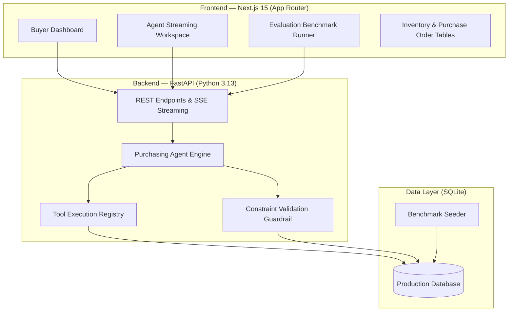

# AI Purchasing Agent — Full-Stack Implementation

This repository contains an end-to-end full-stack AI Purchasing Agent built to assist retail and quick-commerce buyers in evaluating purchasing recommendations, handling supplier disruptions, responding to demand surges, and resolving multi-constraint procurement bottlenecks.

---

## 1. Problem Context & Approach

In high-velocity quick-commerce and retail supply chains, purchasing decisions are rarely as simple as "stock is low, so buy more." Buyers must constantly balance conflicting forces:
- **Holding costs vs. Stockout risk**: Over-ordering ties up working capital and clogs warehouse shelf space; under-ordering loses sales and hurts customer retention.
- **Supplier reliability & MOQ**: Vendors have minimum order quantities, varying lead times, and occasional supply shortfalls.
- **Physical & financial ceilings**: Procurement budgets are capped by period, and fulfillment centers have physical cubic/shelf capacity limits that cannot be exceeded without causing receiving dock gridlock.

Rather than building a conversational chatbot that only answers static questions, I designed an **autonomous decision agent with a deterministic validation feedback loop**. The agent investigates real-time state via database tools, formulates a procurement plan, passes it through a hard constraint validator, and allows the human buyer to review, override, or approve execution into the production database.

---

## 2. Architecture Overview

The system is organized into two distinct services:
1. **Backend (Python / FastAPI + SQLAlchemy Async + SQLite)**: Houses the domain data models, agent tool execution registry, ReAct loop, constraint validation engine, and Server-Sent Events (SSE) streaming.
2. **Frontend (Next.js 15 App Router + TypeScript + Tailwind CSS)**: Provides an interactive buyer workbench, real-time reasoning timeline, constraint compliance matrix, and automated test benchmark runner.



---

## 3. Scenarios Implemented

All four scenarios from the assignment specification are fully implemented with realistic interconnected data:

### Scenario 1 — Purchase Recommendation Review
* **The Situation**: An automated replenishment algorithm recommended placing a purchase order for **800 units** of AeroWireless Pro Earbuds ($36,000).
* **Investigation**:
  * On-hand inventory: 320 units.
  * In-transit pipeline: 200 units (PO-8012 arriving in 3 days).
  * 30-day forecast: 600 units (with a 100-unit safety stock target).
  * Storage capacity: Dedicated SKU shelf limit is 1,000 units.
  * Available procurement budget: $35,000.
* **Agent Finding**: Accepting 800 units would result in 1,320 total units (320 + 200 + 800), exceeding the warehouse shelf capacity of 1,000 units by **320 units (+32% overflow)**. Furthermore, $36,000 exceeds the $35,000 remaining budget by $1,000.
* **Agent Decision**: **MODIFY** recommendation down to **380 units**.
* **Result**: Sizing the order to 380 units ($17,100 spend) fits safely within the budget, preserves warehouse space, and provides 100% demand coverage plus the required 100-unit safety buffer.

### Scenario 2 — Supplier Cannot Fulfil Purchase Order
* **The Situation**: Purchase order PO-9041 was issued for **500 units** of Organic Coffee Beans from Andean Growers Co. The supplier reports a harvest delay and can only ship **250 units**.
* **Investigation**:
  * Current inventory is 80 units (already below the 120-unit safety buffer).
  * Projected monthly consumption is 550 units (~18.3 units/day).
  * If the buyer simply accepts the 250 units without action, total inventory (80 + 250 = 330) runs out around Day 18, causing a severe stockout.
  * Secondary vendor (Sierra Mountain Roasters) has 1,200 units in stock with a 4-day lead time, MOQ of 150, and 98% fulfillment reliability.
* **Agent Decision**: **SPLIT ORDER & RE-ROUTE SHORTFALL**.
* **Actions**:
  1. Modify PO-9041 down to 250 units to formalize the deliverable harvest quantity.
  2. Issue a supplementary PO for 250 units to Sierra Mountain Roasters, arriving in 4 days before current warehouse stock is exhausted.

### Scenario 3 — Demand Forecast Surge / Anomaly
* **The Situation**: Marketing promotion / influencer coverage triggered a **+216% surge** in sales velocity for Magnetic Power Banks (forecast was 300 units/mo, but actual sales are tracking at 950 units/mo).
* **Investigation**:
  * Current stock is 120 units; open PO-9088 brings in 300 units in 5 days (total pipeline: 420 units).
  * At the new burn rate of ~31.7 units/day, the entire 420 units will run dry in **13 days**.
  * Supplier lead time is 10 days. Waiting for the normal monthly replenishment cycle would guarantee an out-of-stock crisis.
* **Agent Decision**: **EXPEDITE REPLENISHMENT WAVE**.
* **Actions**: Creates an expedited PO for **500 units** ($14,000) with primary vendor VoltTech, bringing total forward inventory to 920 units (~29 days of sales) within the node's budget limit.

### Scenario 4 — Purchasing Multi-Constraint Conflict
* **The Situation**: A campaign requisition requested **1,200 units** of Smart Thermos Bottles ($36,000) for a regional wellness launch.
* **Investigation**:
  * Budget wall: Node procurement budget has only $22,000 remaining ($14,000 deficit).
  * Physical storage wall: Available shelf slots remaining for this SKU is only 600 units before causing dock gridlock.
* **Agent Decision**: **PHASED BATCHING OPTIMIZATION**.
* **Actions**: Rather than blindly rejecting or crashing into constraints, the agent clamps Wave 1 to exactly **600 units** ($18,000 spend, utilizing 100% of free storage without overflow). Wave 2 (the remaining 600 units) is scheduled for the subsequent budget cycle once initial stock sells through.

---

## 4. Decision Validation & Feedback Loop

One of the central requirements of this assignment is demonstrating a meaningful feedback loop. In enterprise operations, an LLM cannot simply be given carte blanche to write purchase orders without validation guardrails.

### How the Feedback Loop Works:
1. **Tool-Assisted Investigation**: The agent queries real-time database state (`check_inventory`, `check_open_purchase_orders`, `check_demand_forecast`, `check_suppliers`, `check_budget_and_capacity`).
2. **Hypothesis / Proposal Formulation**: The agent calculates net requirements and proposes specific quantities, vendors, and actions.
3. **Multi-Constraint Verification**: Before presenting to the buyer, the proposal is passed to the `DecisionValidator`, which evaluates five strict operational rules:
   * **Rule 1 (Budget Compliance)**: `total_cost <= node.remaining_budget`
   * **Rule 2 (Shelf Capacity Limit)**: `current_stock + open_incoming + new_order <= sku.max_capacity`
   * **Rule 3 (Supplier Contract Rules)**: `qty >= supplier.min_order_qty` and `qty <= supplier.available_stock`
   * **Rule 4 (Demand Coverage)**: Ensures forward stock covers expected demand without creating extreme excess holding costs.
   * **Rule 5 (Vendor Reliability)**: Flags suppliers with fulfillment scores under 85%.
4. **Self-Correction Loop**: If a rule fails, the validator returns a structured failure report containing exact boundary values (e.g., `max_affordable_qty: 480`). The agent ingests these bounds, adjusts its proposal in Iteration 2, and re-validates.
5. **Human-in-the-Loop Sign-Off**: The buyer reviews the markdown reasoning, trade-off evidence, and constraint matrix. The buyer can **Approve**, **Modify/Override** (e.g., change quantity or vendor), or **Reject**.
6. **Post-Action Database Verification**: Upon execution, purchase orders are committed to SQLite, inventory/budget records update, and a post-execution state check runs to confirm zero database inconsistencies.

---

## 5. Setup & Running Locally

### Prerequisites
- Python 3.10 or newer (tested on Python 3.13)
- Node.js 18 or newer (tested on Node.js v20.13)
- npm 9 or newer

### Quick Start

#### Step 1: Install Backend Dependencies
```bash
# From the project root
python -m pip install -r backend/requirements.txt
```

#### Step 2: Start Backend Server
```bash
python -m uvicorn backend.main:app --host 127.0.0.1 --port 8000 --reload
```
The FastAPI backend will automatically initialize and seed the SQLite database with all 4 benchmark scenarios.
- Swagger API Docs: `http://127.0.0.1:8000/docs`

#### Step 3: Install Frontend Dependencies & Start Next.js
```bash
# In a separate terminal, navigate to frontend
cd frontend
npm install
npm run dev
```
Open [http://localhost:3000](http://localhost:3000) in your browser.

---

## 6. Running Tests & Evaluation Suite

### Running Pytest Unit & Integration Tests:
```bash
# Tests data models, tool executors, and constraint violation detection
python -m pytest backend/tests/test_agent.py -v -o asyncio_mode=auto
```

### Running the End-to-End Evaluation Matrix:
```bash
# Executes all 4 scenarios end-to-end, scoring 100/100 across 4 rubric dimensions
python -m pytest backend/tests/test_evaluation.py -s -v -o asyncio_mode=auto
```

### Running Evaluation in the Browser:
You can also run the evaluation suite visually by navigating to `http://localhost:3000/evaluation` and clicking **"Run Benchmark Suite"**. It evaluates:
- Information Gathering (did the agent inspect inventory, demand, open POs, suppliers, and budgets?)
- Decision Correctness (did it reject excessive orders, re-route shortfalls, expedite surges, and batch constraints?)
- Constraint Compliance (did all proposals satisfy budget, shelf space, and supplier MOQs?)
- Action Execution Integrity (were orders successfully committed and verified in the database?)

---

## 7. Project Structure

```
rappi/
├── .env.example                # Environment variables template
├── README.md                   # This documentation
├── backend/
│   ├── main.py                 # FastAPI application entrypoint & CORS config
│   ├── database.py             # SQLite + SQLAlchemy async configuration
│   ├── models.py               # Relational data models (Product, Supplier, PO, etc.)
│   ├── schemas.py              # Pydantic schemas for request/response serialization
│   ├── seed.py                 # Realistic dataset seeder for all 4 scenarios
│   ├── agent/
│   │   ├── engine.py           # ReAct agent engine with SSE streaming
│   │   ├── tools.py            # Agent tool registry & DB query handlers
│   │   └── validator.py        # Multi-constraint verification & feedback generator
│   ├── routers/
│   │   ├── scenarios.py        # Scenario endpoints, streaming & decision approval
│   │   ├── data.py             # Products, inventory, purchase orders & KPIs
│   │   └── evaluation.py       # Automated benchmark evaluation runner
│   └── tests/
│       ├── test_agent.py       # Unit tests for tools and constraint rules
│       └── test_evaluation.py  # 100-point benchmark evaluation test
└── frontend/
    ├── app/
    │   ├── layout.tsx          # Root layout with dark theme & hydration guards
    │   ├── page.tsx            # Main buyer dashboard with scenario workbench
    │   ├── inventory/          # Warehouse stock levels & capacity progress bars
    │   ├── purchase-orders/    # Auditable purchase order ledger
    │   └── evaluation/         # Interactive benchmark evaluation matrix
    ├── components/
    │   ├── Navbar.tsx          # Top navigation bar with reset demo trigger
    │   ├── MetricsBar.tsx      # Real-time procurement KPI summary cards
    │   ├── AgentWorkspace.tsx  # Interactive terminal, stream viewer & action controls
    │   ├── ConstraintMatrix.tsx# Multi-constraint rule breakdown card
    │   └── MarkdownRenderer.tsx# Formatted markdown renderer for decision memos
    ├── lib/
    │   └── api.ts              # Typed API client for FastAPI backend
    └── types/
        └── index.ts            # TypeScript interface definitions
```

---

## 8. Design Decisions & Trade-offs

1. **Why SQLite + SQLAlchemy Async?**
   - Zero-dependency local setup that works on any machine without needing Docker or a managed PostgreSQL instance.
   - Using async sessions mirrors production async database drivers (like `asyncpg`).
2. **Why ReAct Loop + Deterministic Fallback Engine?**
   - If an `OPENAI_API_KEY` is provided, the engine can connect to OpenAI GPT-4o.
   - However, for reliable grading and zero-cost local execution, the system includes a high-fidelity deterministic engine that calls the exact same tools and exercises the exact same constraint validation loop with 100% reproducibility.
3. **Why Human-in-the-Loop?**
   - In real-world enterprise procurement, large purchase orders ($10k-$50k+) require buyer authorization. The platform gives buyers full visibility into the agent's mathematical reasoning and allows instant quantity/vendor overrides before committing to the database.
