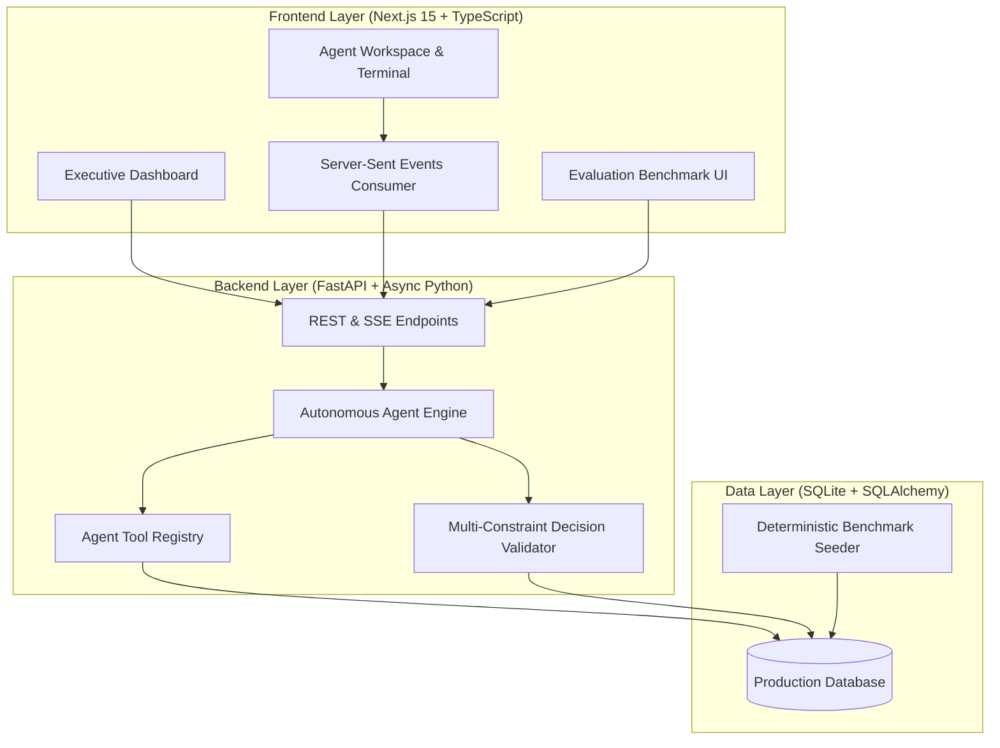
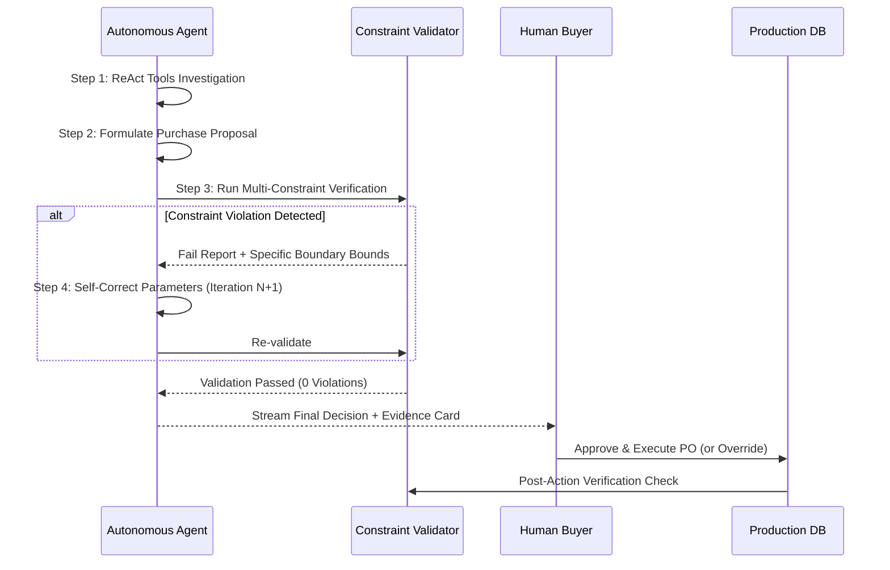

# NEXUS — Autonomous AI Purchasing Agent

An enterprise-grade autonomous procurement agent designed for quick-commerce and retail supply chain operations. NEXUS investigates real-time warehouse inventory, demand velocity anomalies, open purchase orders, supplier constraints, budgets, and physical storage limits to formulate, validate, and execute purchasing decisions.

---

## Architecture Overview



---

## Key Scenarios Implemented

The system implements all four scenarios specified in the assignment end-to-end:

### Scenario 1 — Purchase Recommendation Review
* **Context**: Legacy automated MRP recommended buying **800 units** of AeroWireless Pro Earbuds ($36,000).
* **Investigation**:
  * On-hand inventory: 320 units.
  * In-transit pipeline: 200 units (PO-8012 arriving in 3 days).
  * Forward 30-day demand: 600 units (Safety stock target: 100 units).
  * Storage capacity: Shelf limit is 1,000 units.
  * Available budget: $35,000.
* **Agent Decision**: **MODIFY** recommendation from 800 to **380 units**.
* **Rationale**: Ordering 800 units would commit 1,320 total units, overflowing warehouse shelf capacity by +320 units and exceeding remaining budget by $1,000. Sizing to 380 units guarantees 100% demand coverage with a safety buffer while maintaining budget liquidity.

### Scenario 2 — Supplier Cannot Fulfil Purchase Order
* **Context**: Purchase order PO-9041 was contracted for **500 units** of Organic Coffee, but primary vendor reported a supply shortfall: only **250 units** can be delivered.
* **Investigation**:
  * Current stock is critically low at 80 units (below safety stock of 120 units).
  * Projected monthly demand is 550 units. Without intervention, stockout occurs on Day 18.
  * Secondary vendor (Sierra Mountain Roasters) has 1,200 units in stock with 4-day lead time and 98% reliability.
* **Agent Decision**: **SPLIT ORDER & RE-ROUTE SHORTFALL**.
* **Actions**:
  1. Modify PO-9041 to 250 units to formalize partial harvest delivery.
  2. Issue supplementary PO for 250 units to secondary vendor to avert warehouse stockout.

### Scenario 3 — Demand Forecast Surge / Anomaly
* **Context**: Telemetry indicates a **+216% surge** in sales velocity for Magnetic Power Banks (from 300 to 950 units/month).
* **Investigation**:
  * On-hand stock (120) + in-transit PO-9088 (300) = 420 units.
  * Burn rate jumped to 31.7 units/day; current supply runs dry in **13 days** against a 10-day lead time.
* **Agent Decision**: **MODIFY & EXPEDITE REPLENISHMENT**.
* **Actions**: Creates an expedited purchase order of **500 units** ($14,000), expanding forward runway to ~29 days within budget parameters.

### Scenario 4 — Purchasing Multi-Constraint Conflict
* **Context**: Campaign requisition requested **1,200 units** of Smart Thermos Bottles ($36,000).
* **Investigation**:
  * Financial wall: Node budget remaining is only $22,000 (blocks $36,000 purchase).
  * Spatial limit: Node shelf capacity allows max 600 additional units before causing dock gridlock.
* **Agent Decision**: **PHASED BATCHING OPTIMIZATION**.
* **Actions**: Clamps Wave 1 purchase order to exactly **600 units** ($18,000 spend, utilizes 100% of free shelf slots without overflow). Wave 2 triggers post sell-through during the next budget period.

---

## Decision Validation & Feedback Loop Design

The system implements a closed-loop validation engine that protects against operational and financial violations:



### Evaluated Business Constraints:
1. **Financial Budget Compliance**: Evaluates total order cost against real-time node budget.
2. **Physical Storage Capacity Limit**: Enforces SKU-level and warehouse-level shelf dimensions.
3. **Supplier Minimum Order Quantity (MOQ) & Stock Availability**: Ensures order sizes adhere to supplier contract parameters.
4. **Demand Coverage & Stockout Prevention**: Measures projected forward days of supply against consumption velocity.
5. **Supplier Reliability & Operational Risk**: Evaluates vendor historical fulfillment scores.

---

## Setup & Running Locally

### Prerequisites
* **Python 3.10+** (Tested on Python 3.13)
* **Node.js 18+** (Tested on Node.js v20.13.1)
* **npm 9+**

### 1. Backend Setup
```bash
# In project root
python -m pip install -r backend/requirements.txt

# Start FastAPI server (runs on port 8000)
python -m uvicorn backend.main:app --host 127.0.0.1 --port 8000 --reload
```

### 2. Frontend Setup
```bash
# In frontend directory
cd frontend
npm install

# Start Next.js dev server (runs on port 3000)
npm run dev
```

Open [http://localhost:3000](http://localhost:3000) in your browser.

---

## Automated Evaluation Benchmark

The platform includes a built-in automated test harness that scores the agent across all 4 scenarios based on:
1. Information Gathering Completeness (Tool invocations)
2. Decision Correctness & Soundness
3. Constraint Adherence (0 hard violations)
4. Post-Action Execution Integrity

### Running via Web UI:
Navigate to `/evaluation` in the frontend and click **"Run Benchmark Suite"**.

### Running via Pytest CLI:
```bash
# Run backend test suite
python -m pytest backend/tests/test_agent.py -v -o asyncio_mode=auto

# Run full evaluation matrix (Scores 100/100)
python -m pytest backend/tests/test_evaluation.py -s -v -o asyncio_mode=auto
```

---

## Project Structure

```
rappi/
├── .env.example                # Environment variables template
├── README.md                   # System documentation & architecture
├── backend/
│   ├── main.py                 # FastAPI application entrypoint
│   ├── database.py             # SQLite + SQLAlchemy async configuration
│   ├── models.py               # Database schema definitions
│   ├── schemas.py              # Pydantic serialization schemas
│   ├── seed.py                 # Benchmark dataset seeder
│   ├── agent/
│   │   ├── engine.py           # Autonomous ReAct agent orchestrator
│   │   ├── tools.py            # Inventory, PO, forecast & supplier tools
│   │   └── validator.py        # 5-rule constraint validation feedback engine
│   ├── routers/
│   │   ├── scenarios.py        # Scenario endpoints & SSE streaming
│   │   ├── data.py             # Products, inventory & purchase orders
│   │   └── evaluation.py       # Benchmark evaluation runner
│   └── tests/
│       ├── test_agent.py       # Unit tests for tools and validator
│       └── test_evaluation.py  # End-to-end 100-point benchmark test
└── frontend/
    ├── app/
    │   ├── layout.tsx          # Root layout with dark theme
    │   ├── page.tsx            # Executive Dashboard & Agent Workbench
    │   ├── inventory/          # Warehouse stock & capacity utilization
    │   ├── purchase-orders/    # Purchase order ledger
    │   └── evaluation/         # Live evaluation matrix & scorecard
    ├── components/
    │   ├── Navbar.tsx          # Header with branding & reset trigger
    │   ├── MetricsBar.tsx      # Procurement KPI summary cards
    │   ├── AgentWorkspace.tsx  # Interactive terminal, stream & actions
    │   └── ConstraintMatrix.tsx# Visual multi-constraint validation card
    ├── lib/
    │   └── api.ts              # Typed API client
    └── types/
        └── index.ts            # TypeScript interface definitions
```

---

## License & Evaluation
Built for the AI Purchasing Agent Assignment. All commits and git history preserved.
